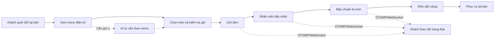
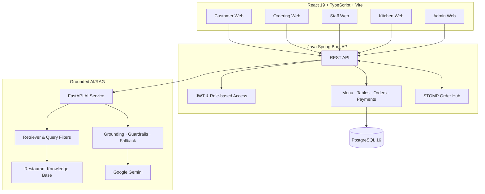

<div align="center">
  
  <h1>CMC Restaurant — QR AI Ordering</h1>
  <p><strong>Quét QR, gọi món, phối hợp vận hành và tư vấn món ăn bằng AI trên một nền tảng thống nhất.</strong></p>
  <p>
    <a href="https://cmcrestaurant.app">Trải nghiệm khách hàng</a> ·
    <a href="https://admin.cmcrestaurant.app">Cổng vận hành</a> ·
    <a href="docs/BA_SA_SYSTEM_DESIGN.md">Kiến trúc</a> ·
    <a href="docs/API_CONTRACT.md">API</a> ·
    <a href="#bắt-đầu-phát-triển">Bắt đầu phát triển</a>
  </p>
  <p>
    <a href="https://github.com/Anpham120/restaurant-qr-ai-ordering/actions/workflows/ci.yml"></a>
    <a href="https://github.com/Anpham120/restaurant-qr-ai-ordering/actions/workflows/security.yml"></a>
    <a href="https://github.com/Anpham120/restaurant-qr-ai-ordering/actions/workflows/deploy-production.yml"></a>
    <a href="LICENSE"></a>
  </p>
</div>

---

## Sản phẩm giải quyết điều gì?

CMC Restaurant số hóa toàn bộ hành trình phục vụ tại bàn: khách mở menu bằng QR mà không cần cài ứng dụng, tự chọn món và theo dõi đơn; nhân viên và bếp nhận cùng một trạng thái vận hành; quản trị viên kiểm soát menu, bàn và đơn hàng từ một hệ thống duy nhất.

AI được đặt trong đúng vai trò hỗ trợ: tư vấn dựa trên menu và kho tri thức của nhà hàng, giải thích lựa chọn và chuyển tiếp cho nhân viên khi câu hỏi vượt phạm vi. AI không tự tạo đơn, thêm món hoặc thực hiện thanh toán.

| Khả năng | Giá trị nhận được |
| --- | --- |
| **QR ordering tại bàn** | Giảm thời gian chờ gọi món, tránh nhầm bàn và không yêu cầu cài app |
| **Điều phối theo thời gian thực** | Nhân viên, bếp và khách nhìn thấy tiến độ đơn nhất quán |
| **Không gian làm việc theo vai trò** | Customer, ordering, staff, kitchen và admin có giao diện đúng nhiệm vụ |
| **AI tư vấn có grounding** | Câu trả lời dựa trên menu/knowledge base, có guardrail và fallback được kiểm soát |
| **Vận hành có thể kiểm chứng** | CI, security checks, health checks, staging, production và rollback được quản lý bằng workflow |

## Trải nghiệm theo vai trò

| Vai trò | Trải nghiệm chính |
| --- | --- |
| **Khách hàng** | Khám phá nhà hàng, xem menu và bắt đầu hành trình gọi món |
| **Khách tại bàn** | Quét QR, chọn món, chat với AI, gửi đơn và theo dõi trạng thái |
| **Nhân viên** | Theo dõi bàn, tiếp nhận đơn và hỗ trợ khách trong quá trình phục vụ |
| **Bếp** | Xem hàng đợi món, cập nhật tiến độ chuẩn bị và phối hợp giao món |
| **Quản trị viên** | Quản lý menu, bàn, mã QR, đơn hàng và số liệu vận hành |



## Giao diện sản phẩm

Ảnh chụp trực tiếp từ các ứng dụng production ngày **17/07/2026**. Gallery này phản ánh giao diện hiện hành, không dùng lại ảnh từ các báo cáo issue cũ.

<table>
  <tr>
    <td width="50%" align="center">
      
      <br /><strong>Website nhà hàng</strong>
    </td>
    <td width="50%" align="center">
      
      <br /><strong>Menu ẩm thực hiện hành</strong>
    </td>
  </tr>
  <tr>
    <td width="50%" align="center">
      
      <br /><strong>Điểm vào gọi món bằng QR</strong>
    </td>
    <td width="50%" align="center">
      
      <br /><strong>Cổng vận hành</strong>
    </td>
  </tr>
</table>

## Kiến trúc



Backend nghiệp vụ được tổ chức như một modular monolith để giữ transaction và luồng order/payment nhất quán. AI/RAG là service độc lập vì có vòng đời dependency, evaluation và khả năng mở rộng khác với nghiệp vụ nhà hàng.

### Công nghệ chính

| Lớp | Công nghệ |
| --- | --- |
| Frontend | React 19, TypeScript, Vite, React Router, STOMP client (`@stomp/stompjs`) |
| Backend | Java 21, Spring Boot 3.3, Spring Data JPA, Flyway, STOMP/WebSocket, JWT |
| Data | PostgreSQL 16 |
| AI service | Python 3.12, FastAPI, RAG, sentence-transformers, Gemini |
| Testing | Vitest, JUnit 5 + ArchUnit + Testcontainers, Python unittest/evaluation |
| Delivery | GitHub Actions, Docker Compose, Nginx, HTTPS, staging/production |

### AI, bảo mật và độ tin cậy

- **Grounded AI:** truy xuất menu và knowledge base trước khi tạo câu trả lời; filter loại món, ràng buộc và menu exclusions được kiểm thử riêng.
- **Guardrails:** AI không được phép tự tạo đơn, thay đổi giỏ hoặc thanh toán; câu hỏi ngoài phạm vi có fallback/escalation.
- **Session tại bàn:** QR token và table session được backend xác thực, xoay vòng và không được tin cậy chỉ từ client.
- **Phân quyền:** JWT và role-based authorization tách quyền customer, staff, kitchen và admin.
- **Secrets:** khóa AI, signing key và database credentials chỉ được cấu hình phía server qua environment/secrets.
- **Reliability:** health checks cho PostgreSQL, API, AI và frontend; migration tách riêng; deployment có staging, promotion và rollback.
- **Verification:** CI build/test frontend, backend, AI/RAG và kiểm tra Docker Compose trên pull request/push.

Tài liệu chuyên sâu: [modular monolith](docs/backend/ARCHITECTURE.md), [AI/RAG architecture](docs/archive/AI_ARCHITECTURE.md), [security policy](SECURITY.md) và [production operations](docs/devops/PIPELINE_AND_DEPLOY.md).

## Bắt đầu phát triển

### Yêu cầu

- Node.js 24 và npm.
- JDK 21 (Gradle wrapper đi kèm, không cần cài Gradle riêng).
- Python 3.12.
- PostgreSQL 16 hoặc Docker/Docker Compose.

Sao chép các tệp `.env.example` tương ứng và chỉ dùng secret dành cho môi trường local.

### Cách nhanh nhất: cả hệ thống bằng một lệnh

```powershell
Copy-Item deploy\env\local.example.env deploy\.env    # rồi sửa 3 giá trị bắt buộc ở đầu tệp
docker compose --env-file deploy\.env -f deploy\docker-compose.java.yml --profile migrate run --rm --build migrate
docker compose --env-file deploy\.env -f deploy\docker-compose.java.yml up -d --build
```

| Địa chỉ | Là gì |
|---|---|
| <http://127.0.0.1:8080> | giao diện khách + vận hành |
| <http://127.0.0.1:8081/api/health> | API Java |
| <http://127.0.0.1:8001/ready> | dịch vụ AI |

Hai điều đáng biết trước:

- **`migrate` là bước riêng, phải chạy trước.** API cố ý không tự migrate lúc khởi động — nhiều
  instance cùng migrate một cơ sở dữ liệu là loại lỗi chỉ xảy ra khi triển khai thật.
- **Ảnh dịch vụ AI nặng (~9 GB)** vì có `torch` và mô hình embedding. Lần dựng đầu mất khá lâu;
  những lần sau dùng lại ảnh đã có.

Hạ stack: `docker compose --env-file deploy\.env -f deploy\docker-compose.java.yml down`
(thêm `-v` nếu muốn xoá luôn dữ liệu Postgres).

### Frontend

```powershell
cd frontend
npm ci
npm run dev
```

Các workspace khác:

```powershell
npm run dev:ordering
npm run dev:admin
npm run dev:kitchen
npm run dev:staff
```

### Backend

```powershell
cd backend-java && ./gradlew bootRun
```

Thiết lập PostgreSQL và migration: [Backend Database Setup](docs/backend/DATABASE.md).

### AI/RAG service

```powershell
cd ai
python -m venv .venv
.\.venv\Scripts\Activate.ps1
pip install -r requirements.txt
uvicorn service:app --app-dir app --reload --port 8001
```

AI service vẫn có fallback có kiểm soát khi chưa cấu hình `GEMINI_API_KEY`; xem [AI Chatbot](docs/archive/AI_ARCHITECTURE.md) và [AI Knowledge Base Guide](docs/archive/AI_KNOWLEDGE_BASE_GUIDE.md).

### Kiểm chứng

```powershell
npm --prefix frontend test
npm --prefix frontend run build
cd backend-java && ./gradlew build
$env:PYTHONPATH = "ai"
python -m unittest discover -s ai/tests
python -m compileall ai/app
docker compose --env-file deploy\.env -f deploy\docker-compose.java.yml config
```

## Cấu trúc repository

```text
.
├── frontend/   # 5 React/Vite apps, shared packages và frontend tests
├── backend-java/  # Java Spring Boot API, domain modules và test
├── ai/         # FastAPI service, RAG pipeline, knowledge base và evaluation
├── deploy/     # Docker Compose và cấu hình triển khai
├── docs/       # Product, architecture, API, quality và operations
└── .github/    # CI/CD, security, issue và pull request templates
```

## Tài liệu

Điểm bắt đầu đầy đủ: **[Documentation Hub](docs/README.md)**. Hub chỉ quảng bá các tài liệu đang được dùng làm điểm vào hiện hành; kế hoạch và bằng chứng lịch sử vẫn được giữ trong repository để truy vết nhưng không được xem là mô tả trạng thái mới nhất.

| Chủ đề | Tài liệu chính |
| --- | --- |
| Product & system design | [BA/SA System Design](docs/backend/ARCHITECTURE.md) · [SPEC](SPEC.md) |
| API & architecture | [API Contract](docs/backend/API_CONTRACT.md) · [Backend Architecture](docs/backend/ARCHITECTURE.md) |
| AI & RAG | [AI/RAG Architecture](docs/archive/AI_ARCHITECTURE.md) · [Evaluation Runbook](docs/archive/AI_EVALUATION.md) · [Retriever ADR](docs/ai/AI_DECISION_HISTORY.md) |
| Verification | [E2E Multi-device Checklist](docs/archive/TESTING.md) |
| Delivery & operations | [Deployment](docs/devops/PIPELINE_AND_DEPLOY.md) · [Production Operations](docs/devops/PIPELINE_AND_DEPLOY.md) |

## Trạng thái và định hướng

Dự án đang ở giai đoạn MVP/demo đã triển khai trực tuyến. Các luồng QR table session, menu, order, payment, realtime, role-based operations và AI/RAG đều có implementation cùng test/evidence trong repository; độ sẵn sàng production tiếp tục được củng cố qua evaluation, observability và security hardening.

Ưu tiên tiếp theo:

- Mở rộng regression/E2E coverage cho hành trình đa thiết bị.
- Theo dõi chất lượng retrieval và grounded response bằng bộ evaluation tái lập.
- Hoàn thiện accessibility, performance budget và trải nghiệm mobile.
- Tăng cường observability, backup/restore và operational readiness.

## Đóng góp

Đọc [CONTRIBUTING.md](CONTRIBUTING.md), tạo branch từ `develop` và dùng pull request template của dự án. Quy ước nhánh, review và release nằm trong [Documentation Hub](docs/README.md).

## Giấy phép

Dự án được phát hành theo [MIT License](LICENSE).

---

<div align="center">
  Built for a faster, clearer and more reliable restaurant service flow.
</div>
