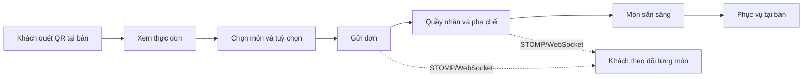
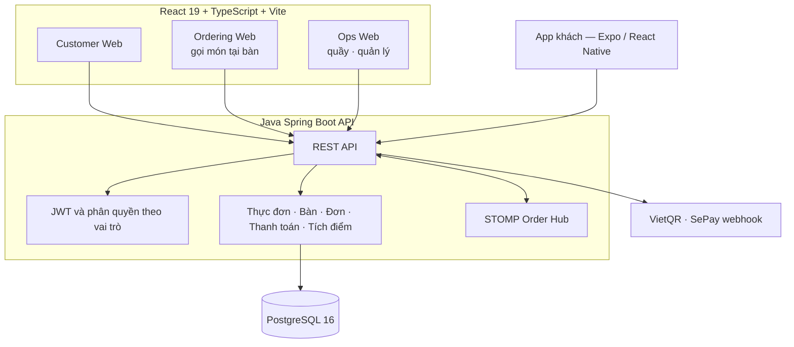

<div align="center">
  
  <h1>Mây — Gọi món bằng QR tại quán</h1>
  <p><strong>Quán trà, kem, chè và món ăn nhẹ. Khách quét QR tại bàn để gọi món; quầy và quản lý
  nhìn cùng một trạng thái.</strong></p>
  <p>
    <a href="docs/pm/CHOT_NGHIEP_VU_QUAN_P0.md">Nghiệp vụ P0</a> ·
    <a href="docs/backend/ARCHITECTURE.md">Kiến trúc</a> ·
    <a href="docs/backend/API_CONTRACT.md">API</a> ·
    <a href="#bắt-đầu-phát-triển">Bắt đầu phát triển</a>
  </p>
  <p>
    <a href="https://github.com/Anpham120/restaurant-qr-ordering-mobile/actions/workflows/ci.yml"></a>
    <a href="https://github.com/Anpham120/restaurant-qr-ordering-mobile/actions/workflows/security.yml"></a>
    <a href="LICENSE"></a>
  </p>
</div>

---

> **Kho đang trong đợt chuyển đổi.** Hệ thống được xây lại quanh nghiệp vụ **quán nước — kem —
> chè — ăn nhanh**, thay cho mô hình nhà hàng trước đó. Backend đã chuyển xong phần lõi; giao diện
> web cũ **đã gỡ hết** và đang được dựng lại. Phạm vi đã chốt và những gì còn chờ duyệt nằm ở
> [Chốt nghiệp vụ quán — P0](docs/pm/CHOT_NGHIEP_VU_QUAN_P0.md).

## Sản phẩm giải quyết điều gì?

Một quán đồ uống và tráng miệng bán tại chỗ. Khách ngồi tại bàn quét QR để tự gọi món và theo dõi
đơn của mình; khách tới quầy mua mang về thì nhân viên nhập món, thu tiền trước và cấp mã nhận.
Quản lý xem thực đơn, ưu đãi, ca quầy và số liệu từ một cổng duy nhất.

**Hai kênh, không có kênh thứ ba.** `DineIn` (ăn tại quán) và `Takeaway` (mua tại quầy mang về).
Không đặt trước từ xa, không giao tận nhà — mọi thứ liên quan tới địa chỉ, phí ship và tài xế đã
ra khỏi phạm vi.

| Khả năng | Giá trị nhận được |
| --- | --- |
| **Gọi món bằng QR tại bàn** | Không phải cài app, không nhầm bàn, không phải chờ gọi nhân viên |
| **Tuỳ chọn theo ly** | Cỡ, mức đường, mức đá, topping — hai ly cùng món khác cỡ là hai dòng riêng, mỗi dòng chụp lại giá đã tính phụ thu |
| **Trạng thái theo TỪNG MÓN** | Bàn gọi 4 món mà xong 1 thì khách thấy đúng món nào đã xong, không phải đoán |
| **Chốt giá lúc đặt** | Khách gửi kèm tổng đang nhìn thấy; máy chủ tính lại và từ chối nếu lệch, thay vì âm thầm thu theo giá mới |
| **Điều phối thời gian thực** | Khách, quầy và quản lý nhận cùng một sự kiện qua STOMP/WebSocket |
| **Vận hành kiểm chứng được** | CI, quét bảo mật, kiểm sức khoẻ, staging, production và quay lui đều chạy bằng workflow |

## Ba vai trò

| Vai trò | Trải nghiệm chính |
| --- | --- |
| **Khách hàng** | Quét QR tại bàn, chọn món kèm tuỳ chọn, gửi đơn, theo dõi từng món, tích điểm và đổi ưu đãi |
| **Nhân viên quầy** | Nhận đơn tại bàn, nhập đơn mang về, pha chế, thu tiền, mở và chốt ca |
| **Quản lý** | Thực đơn, tuỳ chọn, ưu đãi, khách hàng thân thiết, tài khoản nhân sự, báo cáo |

Quán **không có vai bếp riêng** — người pha chế chính là người đứng quầy. `Staff` và `Kitchen` còn
trong mã nguồn thuần tuý để **đọc được** tài khoản cũ, không phải để cấp mới.



## Kiến trúc



Backend là một **modular monolith**: các module dùng chung một cơ sở dữ liệu và một giao dịch, nên
không có trạng thái nửa vời giữa đơn hàng, thanh toán và tích điểm. Mười hai module nghiệp vụ:
`auth`, `cart`, `counter`, `loyalty`, `menu`, `orders`, `payments`, `promotions`, `realtime`,
`reports`, `tables`, `shared`.

### Công nghệ chính

| Lớp | Công nghệ |
| --- | --- |
| Frontend | React 19, TypeScript, Vite — 3 ứng dụng triển khai, 7 gói dùng chung |
| App di động | Expo SDK 57, React Native |
| Backend | Java 21, Spring Boot 3.3.4, Spring Data JPA, Flyway (32 migration), STOMP/WebSocket, JWT |
| Dữ liệu | PostgreSQL 16 |
| Kiểm thử | Vitest, JUnit 5 + ArchUnit + Testcontainers, Jest |
| Triển khai | GitHub Actions, Docker Compose, Nginx, HTTPS, staging/production |

### Bảo mật và độ tin cậy

- **Phiên tại bàn:** mã QR và phiên bàn do backend cấp, xoay vòng và xác thực; không tin dữ liệu
  từ phía client.
- **Phân quyền:** JWT tách quyền khách, nhân viên quầy và quản lý.
- **Bí mật:** khoá ký JWT, khoá webhook thanh toán và thông tin cơ sở dữ liệu chỉ nằm trong biến
  môi trường phía máy chủ — không có giá trị thật nào nằm trong kho mã.
- **Mặc định an toàn:** cấu hình để trống thì cổng liên quan TỪ CHỐI mọi lời gọi, không phải nhận
  tất cả. Áp cho Google, Firebase và webhook SePay.
- **Migration chỉ mở rộng, không co lại:** cột đã tồn tại không bị `DROP`. Nơi dữ liệu cũ không
  ánh xạ được sang nghiệp vụ mới, migration **dừng và bắt người xem** thay vì đoán — xem
  `V32__renames_pickup_to_takeaway.sql`.
- **Kiểm chứng:** CI dựng và kiểm frontend, backend, app di động, dữ liệu thực đơn, cấu hình
  Docker Compose, và chạy một phép kiểm realtime đầu-cuối với backend thật.

Tài liệu chuyên sâu: [kiến trúc backend](docs/backend/ARCHITECTURE.md),
[chính sách bảo mật](SECURITY.md), [CI/CD và vận hành](docs/devops/PIPELINE_AND_DEPLOY.md).

## Bắt đầu phát triển

### Yêu cầu

- Node.js 24 và npm.
- JDK 21 (Gradle wrapper đi kèm, không cần cài Gradle riêng).
- Python 3.12 — cho các script dữ liệu thực đơn và chỉ mục tài liệu.
- PostgreSQL 16 hoặc Docker/Docker Compose.

Chép các tệp `.env.example` tương ứng và chỉ dùng giá trị dành cho máy cá nhân.

### Cách nhanh nhất: cả hệ thống bằng một lệnh

```powershell
Copy-Item deploy\env\local.example.env deploy\.env    # rồi sửa 3 giá trị bắt buộc ở đầu tệp
docker compose --env-file deploy\.env -f deploy\docker-compose.java.yml --profile migrate run --rm --build migrate
docker compose --env-file deploy\.env -f deploy\docker-compose.java.yml up -d --build
```

| Địa chỉ | Là gì |
|---|---|
| <http://127.0.0.1:8080> | giao diện khách + vận hành |
| <http://127.0.0.1:8081/api/health> | API Java |

**`migrate` là bước riêng, phải chạy trước.** API cố ý không tự migrate lúc khởi động — nhiều
instance cùng migrate một cơ sở dữ liệu là loại lỗi chỉ xảy ra khi triển khai thật.

Hạ stack: `docker compose --env-file deploy\.env -f deploy\docker-compose.java.yml down`
(thêm `-v` nếu muốn xoá luôn dữ liệu Postgres).

### Frontend

```powershell
cd frontend
npm ci
npm run dev
```

Các workspace khác: `npm run dev:ordering`, `npm run dev:ops`.

Ba ứng dụng hiện dựng **một màn hình giữ chỗ** (`frontend/src/DangXayLai.tsx`): giao diện của mô
hình nhà hàng đã gỡ hết, giao diện quán chưa dựng. Phần dùng lại được nằm ở `frontend/packages/`.

### Backend

```powershell
cd backend-java && ./gradlew bootRun
```

Thiết lập PostgreSQL và migration: [Backend Database Setup](docs/backend/DATABASE.md).

### Kiểm chứng

```powershell
npm --prefix frontend test
npm --prefix frontend run build
cd backend-java && ./gradlew build
docker compose --env-file deploy\.env -f deploy\docker-compose.java.yml config
```

## Cấu trúc repository

```text
.
├── frontend/      # 3 ứng dụng React/Vite, 7 gói dùng chung, test
├── backend-java/  # API Spring Boot, 12 module nghiệp vụ và test
├── mobile-rn/     # App khách hàng thân thiết (Expo / React Native)
├── deploy/        # Docker Compose, cấu hình môi trường và script triển khai
├── data/          # Dữ liệu thực đơn — nguồn của các cổng kiểm trong CI
├── docs/          # Nghiệp vụ, kiến trúc, API, vận hành và khuôn báo cáo
└── .github/       # CI/CD, quét bảo mật, khuôn issue và pull request
```

## Tài liệu

Điểm bắt đầu: **[Chỉ mục tài liệu](docs/README.md)** — trang đó được **sinh ra** từ chính các tệp
có thật, nên nó không thể trỏ vào tệp không tồn tại.

| Chủ đề | Tài liệu chính |
| --- | --- |
| Nghiệp vụ | [Chốt nghiệp vụ quán — P0](docs/pm/CHOT_NGHIEP_VU_QUAN_P0.md) · [Thiết kế nghiệp vụ](docs/THIET_KE_NGHIEP_VU.md) |
| Kiến trúc và hợp đồng | [Kiến trúc backend](docs/backend/ARCHITECTURE.md) · [Hợp đồng API](docs/backend/API_CONTRACT.md) · [SPEC](SPEC.md) |
| Cơ sở dữ liệu | [Database](docs/backend/DATABASE.md) |
| Vận hành | [CI/CD và triển khai](docs/devops/PIPELINE_AND_DEPLOY.md) · [Triển khai máy chủ](docs/trien-khai-may-chu.md) |
| Quy trình | [Git và làm việc nhóm](docs/devops/GIT_AND_TEAM.md) |

## Trạng thái và định hướng

Backend đã chuyển sang nghiệp vụ quán: hai kênh `DineIn`/`Takeaway`, ba vai trò, không còn giao
tận nhà. Giao diện web đang được dựng lại từ đầu theo nghiệp vụ mới.

Ưu tiên tiếp theo:

- Dựng lại ba ứng dụng web theo nghiệp vụ quán, bắt đầu từ luồng quét QR và gọi món tại bàn.
- Thay dữ liệu thực đơn: bộ hiện tại vẫn là món ăn nhà hàng, chưa phải đồ uống và tráng miệng.
- Giỏ hàng giữ được nhiều dòng cùng một món với tuỳ chọn khác nhau — ràng buộc hiện tại chưa cho.
- Quan trắc: log tập trung, cảnh báo, và số đo thời gian phục vụ thật thay vì ước lượng.
- Sao lưu và khôi phục cơ sở dữ liệu có kiểm chứng, không chỉ có script.

## Đóng góp

Đọc [CONTRIBUTING.md](CONTRIBUTING.md), tạo nhánh từ `develop` và dùng khuôn pull request của dự
án. Quy ước nhánh, review và phát hành nằm trong [Git và làm việc nhóm](docs/devops/GIT_AND_TEAM.md).

## Giấy phép

Dự án được phát hành theo [MIT License](LICENSE).

---

<div align="center">
  Phục vụ nhanh hơn, rõ hơn, và đáng tin hơn.
</div>
