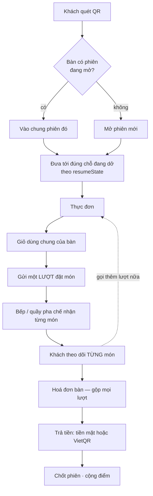
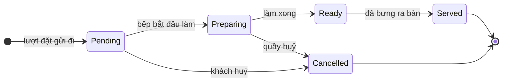

# Phân tích nghiệp vụ — CMC Restaurant

> **Kiểm lần cuối: 2026-09-05.** Mọi luật trong tài liệu này rút từ mã đang chạy, không từ trí
> nhớ hay từ bản kế hoạch. Chỗ nào là **đề xuất** đều ghi rõ.
>
> Đây là tài liệu **làm việc**, viết cho người sắp sửa mã. Nó trả lời "vì sao hệ thống làm thế",
> thứ mà `ARCHITECTURE.md` (cấu trúc) và `API_CONTRACT.md` (giao diện) không trả lời.

---

## 1. Bài toán

Khách ngồi vào bàn, quét mã QR dán sẵn, gọi món trên điện thoại của chính mình, theo dõi từng món,
rồi trả tiền một lần cho cả bàn. Không cài ứng dụng, không chờ gọi nhân viên để gọi món.

Ba ràng buộc định hình toàn bộ thiết kế:

1. **Một bàn có nhiều điện thoại.** Bốn người cùng bàn cùng quét một mã. Họ phải thấy cùng một giỏ
   và cùng một hoá đơn, không phải bốn phiên riêng.
2. **Một bữa ăn có nhiều lượt gọi.** Gọi món chính, ăn xong gọi thêm đồ uống, rồi tráng miệng. Ba
   lượt gọi, một lần trả tiền.
3. **Món không xong cùng lúc.** Bàn gọi 4 món thì 4 món ra ở 4 thời điểm khác nhau, từ những chỗ
   làm khác nhau trong quán.

Ràng buộc 3 là thứ tách hệ thống này khỏi một máy bán hàng thông thường, và nó lan ra khắp thiết
kế: trạng thái, ước lượng thời gian, màn hình bếp, và cả cách nói với khách.

---

## 2. Tác nhân và quyền

| Tác nhân | Xác thực bằng | Làm được gì |
|---|---|---|
| **Khách tại bàn** | token phiên bàn (`X-Table-Session-Token`), không cần tài khoản | Xem thực đơn, sửa giỏ, gửi đơn, theo dõi món, huỷ món **chưa nấu**, xem hoá đơn, chọn cách trả tiền |
| **Khách có tài khoản** | JWT vai `Customer` | Thêm: xem điểm, đổi ưu đãi, lịch sử đơn, đặt lại món cũ |
| **Nhân viên** (`Staff`) | JWT vai `Staff` | Theo dõi bàn, nhận đơn, đổi trạng thái đơn, thu ngân, mở/chốt ca quầy, xác nhận đổi điểm |
| **Bếp** (`Kitchen`) | JWT vai `Kitchen` | Đổi trạng thái **từng món**, báo hết món, khai độ trễ. **Không** đổi được trạng thái đơn ngoài `Ready → Served` |
| **Quản trị** (`Admin`) | JWT vai `Admin` | Toàn bộ: thực đơn, bàn, người dùng, khuyến mãi, ưu đãi, hội viên, báo cáo |

Ranh giới đáng nhớ nhất: **bếp không phải nhân viên**. Vai `Kitchen` bị chặn ở mọi chuyển trạng
thái đơn trừ `Ready → Served` (`KITCHEN_ORDER_STATUS_FORBIDDEN`). Đây là chuyện đã học bằng cách
làm sai — một phép kiểm realtime từng đỏ vì dùng tài khoản `Kitchen` để đổi trạng thái đơn, và lỗi
hiện ra như lỗi realtime chứ không như lỗi phân quyền.

---

## 3. Bản đồ một bữa ăn



---

## 4. Phiên bàn

### Luật

- Mã QR dán ở bàn **không đổi theo lượt khách**. Đổi mã mỗi lượt nghĩa là phải in lại, mà một tờ
  giấy dán bàn thì không in lại được giữa ca.
- Mỗi bàn **tối đa một phiên `Open`**. Ép bằng chỉ mục duy nhất có điều kiện ở cơ sở dữ liệu, không
  bằng kiểm tra trong mã — hai request cùng lúc thì cơ sở dữ liệu chặn, và API đọc lại phiên mà
  request kia vừa tạo thay vì báo lỗi cho khách.
- Vòng đời: `Open → Closed` (quầy chốt) hoặc `Open → Expired` (quá hạn).
- Mở phiên luôn chuyển các phiên quá hạn của bàn đó sang `Expired` **trước**, rồi mới tìm phiên
  còn sống.

### `resumeState` — vì sao cần

Khách khoá màn hình giữa bữa rồi mở lại. Nếu quay về đầu thì họ phải tự nhớ đang làm dở gì. Mỗi
lần quét trả về một trạng thái tất định:

| `resumeState` | Đưa tới |
|---|---|
| `New` | thực đơn |
| `CartPending` | giỏ hàng |
| `OrderInProgress` | theo dõi đơn |
| `ReadyForPayment` · `PaymentPending` · `Paid` | hoá đơn bàn |

Hai đầu phải nói cùng một chuyện: `TableSessionResumeStateResolver` (backend) và
`getSessionResumeDestination` (frontend). Đây là một trong những chỗ dễ trôi nhất của hệ thống —
hai bên viết bằng hai ngôn ngữ, và không có gì tự động bắt lệch.

---

## 5. Giỏ và lượt đặt món

Giỏ thuộc **phiên bàn**, không thuộc thiết bị. Bốn điện thoại cùng bàn sửa cùng một giỏ.

Gửi một lượt đặt món làm hai việc **trong cùng một giao dịch**: ghi đơn, và xoá giỏ. Tách ra thì
có khoảnh khắc đơn đã tạo mà giỏ vẫn còn — người thứ hai bấm gửi sẽ đặt lại đúng những món đó.

Chống trùng bằng **khoá idempotency**: cùng khoá + cùng nội dung thì trả về đơn cũ; cùng khoá +
khác nội dung thì `IDEMPOTENCY_KEY_REUSED`. Vế thứ hai quan trọng — nó bắt lỗi client dùng lại
khoá cho một yêu cầu khác, thứ mà im lặng bỏ qua sẽ làm mất một đơn thật.

---

## 6. Trạng thái: sống ở MÓN, không ở ĐƠN



Trạng thái đơn (`Draft`, `Placed`, `Confirmed`, `Preparing`, `Ready`, `Served`, `Completed`,
`Cancelled`) là **kết quả suy ra** từ các món, không phải một công tắc riêng.

**Vì sao không làm ngược lại.** Bàn gọi 4 món, xong 1. Nếu trạng thái sống ở đơn thì khách thấy
"đang chuẩn bị" suốt và không biết món nào đã lên; bếp cũng không có chỗ ghi rằng ba món kia vẫn
đang làm. Tách theo món thì cả hai phía nhìn thấy đúng việc đang xảy ra.

### Luật huỷ món

Khách chỉ huỷ được món còn `Pending`. Khoá **theo từng món**, không theo đơn — khách huỷ được món
chưa ai đụng tới ngay cả khi món khác cùng đơn đang nấu dở. Bếp đã bỏ nguyên liệu vào thì hết
quyền huỷ của khách (`ORDER_ITEM_CANCEL_NOT_ALLOWED`).

### Luật `Ready → Served`

Bếp bắt buộc đi qua bước này trước khi chốt phiên. Nhảy thẳng `Ready → Completed` bị từ chối ở
tầng nghiệp vụ. Không phải để làm khó: **"đã bưng ra bàn" là sự kiện duy nhất chứng minh khách
thật sự nhận được món**. Bỏ nó đi thì hệ thống không phân biệt được món đã phục vụ với món nấu
xong rồi bỏ quên trên bàn chờ.

---

## 7. Ước lượng thời gian lên món

Một quán **không có một hàng đợi**. Nó có mấy chỗ làm việc song song, và chúng không chờ nhau.

| Trạm | Món | Hàng đợi | Việc song song |
|---|---|---|---|
| `BEP` | món nấu (có nhãn `method:`) | có | `KITCHEN_PARALLEL_DISHES`, mặc định **6** |
| `QUAY` | đồ uống, nước ép | có | `KITCHEN_PARALLEL_BAR_ITEMS`, mặc định **2** |
| `SAN` | rượu, trái cây, tráng miệng — lấy sẵn | không | — |

```
chờ = (tải của TRẠM ĐÓ − chính món này) ÷ số việc song song của trạm
```

Ly bia không chậm đi vì bếp đang đông.

### Độ trễ bếp tự khai

Hàng đợi chỉ đo được thứ đã đi qua ứng dụng. Đầu bếp nghỉ ốm, hỏng lò, đoàn đặt trước đang làm ở
trong — không việc nào nằm trong bất kỳ đơn nào. Bếp nhập số phút cộng thêm (tối đa 60), và nó
**chỉ áp cho món của trạm `BEP`**: không việc nào trong số đó làm chậm một ly cà phê.

> **Lỗi đã sập một lần:** truy vấn tải bếp cộng `prep_minutes` mà quên nhân `quantity`. 30 phần
> của một món bị đếm như 1. Không tập kiểm nào bắt được vì mọi ca kiểm đều dùng `quantity: 1` —
> chỉ phát hiện khi gõ số lượng thật vào hệ thống đang chạy.

---

## 8. Hoá đơn bàn và ba tầng trần giảm giá

### Cách dựng hoá đơn

Hoá đơn **tính lại từ dòng món**, không cộng dồn tổng của từng đơn. Các dòng được gộp theo
`(món, đơn giá)` — gọi phở ba lượt khác nhau thì lên hoá đơn là một dòng ×3.

```
tạm tính = Σ (đơn giá × số lượng)
tổng     = tạm tính − giảm giá        (không âm)
```

**Không có VAT, không phí phục vụ, không tip.** Đây là trạng thái hiện tại — xem §12.

### Ba tầng trần, và vì sao cần cả ba

| Tầng | Trần | Chặn điều gì |
|---|---|---|
| Khuyến mãi của quán | `maxDiscount` của từng mã | một mã tự nó giảm quá sâu |
| Đổi điểm | `min(30% hoá đơn, 200.000đ)` | khách gom điểm cả năm đổi gần hết một bữa |
| **Tổng mọi nguồn** | **50% hoá đơn** | hai khoản hợp lệ cộng lại vẫn ăn quá sâu vào giá vốn |

Tầng thứ ba không thừa. Ví dụ đã tính trong mã: hoá đơn 760.000đ, mã quán giảm 20% (152.000đ) cộng
ưu đãi đổi điểm 200.000đ = 352.000đ — **gần một nửa hoá đơn, trong khi từng khoản đều hợp lệ**.

Trần tổng **cắt phần vượt chứ không từ chối hoá đơn**. Khách đã đứng ở quầy chờ trả tiền; bắt họ
bỏ bớt một mã ở khoảnh khắc đó là đổi một khoản lãi nhỏ lấy một trải nghiệm tệ.

Hoá đơn lưu cả `discountAmount` (tổng sau khi cắt) lẫn `loyaltyDiscountAmount` (phần của điểm) và
`promotionCode` — để sau này còn truy được khoản giảm đến từ đâu.

> **Lỗi đã sập một lần:** ưu đãi đổi điểm từng ghi vào `orders.discount_amount`, trong khi hoá đơn
> bàn tính lại tạm tính từ dòng món rồi chỉ trừ ở cấp hoá đơn. Kết quả: **khách mất điểm và vẫn
> trả đủ tiền.** Bài học: nơi tính tiền và nơi ghi khoản giảm phải cùng một cấp.

---

## 9. Thanh toán và đối soát

`PaymentMethod`: `Unselected` (trạng thái đầu, không ai chọn được), `COD` (tiền mặt tại quầy),
`VietQR`.

`PaymentStatus`: `NotRequested → Pending → Confirmed`/`Paid`, hoặc rẽ sang `Failed`, `Cancelled`,
`Refunded`. (`Unpaid` còn trong enum vì dữ liệu cũ mang chuỗi đó — thiếu hằng số này là lỗi *đọc
dữ liệu*, không phải lỗi logic.)

### Đối soát VietQR

Tiền vào được xác nhận bằng **webhook SePay**, không bằng nhân viên bấm nút. Ba luật:

1. **Chỉ nhận giao dịch tiền VÀO.** Không lọc thì một khoản chuyển đi, tình cờ mang mã đơn trong
   nội dung, cũng đánh dấu đơn đó đã trả tiền.
2. **Không có khoá thì TỪ CHỐI tất cả.** Không phân biệt được webhook thật với giả, mà nhận nhầm
   một cái giả nghĩa là đánh dấu đã trả cho một bàn chưa trả đồng nào.
3. **Chỉ `confirmed` mới nghĩa là tiền đã ghi vào hoá đơn.** Mọi kết quả khác đều là tiền vào tài
   khoản mà không hoá đơn nào được chốt — và đó là thứ phải ghi lại, không phải nuốt đi.

Mã QR **chỉ dựng khi hoá đơn thật sự chọn VietQR**. Dựng vô điều kiện sẽ trả về mã quét được cho
một hoá đơn đang trả tiền mặt — khách quét rồi chuyển khoản thành hai lần thu.

---

## 10. Tích điểm

Khách **tự tải app, tự tạo tài khoản, tự gắn số điện thoại**. Không có bước nhân viên nối hộ.

| Luật | Giá trị |
|---|---|
| Tỷ lệ | 10.000đ = 1 điểm, **làm tròn xuống** |
| Hạng | Bạc ×1,0 · Vàng ×1,25 (chi tiêu tích luỹ ≥ 5tr) · Kim cương ×1,5 (≥ 15tr) |
| Hạn dùng | 12 tháng kể từ ngày tích |

**Làm tròn xuống là có chủ ý**: nó bảo đảm chia nhỏ hoá đơn không bao giờ lợi hơn trả một lần —
điều ngược lại chính là thứ một chương trình khách quen phải tránh.

**Nhân hệ số hạng TRƯỚC khi chia, không phải sau.** Hoá đơn 330.000đ ở hạng Vàng: cách đúng cho
33 × 1,25 = 41,25 → **41 điểm**; nhân sau cho 33 → mất phần lẻ hai lần.

### Điểm hết hạn — vì sao tính bằng số học

Cách hiển nhiên là gắn cho mỗi lô tích một cột "còn lại" rồi trừ dần. Cách đó tạo **nguồn sự thật
thứ hai** bên cạnh `loyalty_members.points`, và hai nguồn thì sẽ có ngày lệch nhau.

Không cần thế. Khách luôn tiêu điểm cũ trước — đó là *định nghĩa* của FIFO, không phải một lựa
chọn cần lưu. Nên chỉ cần hai tổng chạy trên `loyalty_point_ledger`:

```
hết hạn = (tổng ACCRUE quá 12 tháng) − (tổng REDEEM + EXPIRE từ trước tới nay)
```

Âm nghĩa là khách đã tiêu hết chỗ cũ và đang tiêu sang lô mới — không có gì hết hạn.

### Đổi ưu đãi

Phải **quầy xác nhận** (`/api/loyalty/counter/redeem`, `/redemptions/{id}/honour`). Điểm chỉ trừ
khi ưu đãi thật sự được giao. Ưu đãi có hai loại (`FREE_ITEM`, `DISCOUNT`) và có thể yêu cầu hạng
tối thiểu (`LOYALTY_TIER_TOO_LOW`).

---

## 11. Ca quầy

Mở ca với số tiền đầu ca → ghi thu chi phát sinh → chốt ca.

```
lệch = tiền đếm được − tiền hệ thống ghi
```

**Dấu có nghĩa và không được lấy trị tuyệt đối.** Âm là thiếu tiền, dương là ngăn kéo nhiều hơn hệ
thống biết. Cả hai đều cần giải thích, nhưng là hai vấn đề khác nhau.

Chốt ca **không mở lại được**, và ca đã chốt không nhận thêm điều chỉnh. Đây là con số người quản
lý đọc khi tiền thiếu, nên luật quanh nó đặt ở tầng miền chứ không rải ra các endpoint.

---

## 12. Sáu hằng số nghiệp vụ đang chôn trong mã — hạn chế và đề xuất

### Hiện trạng

| Hằng số | Giá trị | Ở đâu |
|---|---|---|
| Tỷ lệ tích điểm | 10.000đ/điểm | `LoyaltyMember.VND_PER_POINT` |
| Hệ số và ngưỡng hạng | 1,0/1,25/1,5 tại 0/5tr/15tr | `MemberTier` |
| Trần đổi điểm | `min(30%, 200.000đ)` | `TranDoiDiem` |
| Trần tổng giảm giá | 50% | `TranGiamGiaHoaDon` |
| Hạn dùng điểm | 12 tháng | `HetHanDiem` (tham số truyền vào) |
| Hạn phiên bàn | 4 giờ | `TableSessionService.DEFAULT_SESSION_LIFETIME` |

Sáu con số này là **chính sách kinh doanh**, không phải hằng số kỹ thuật. Chủ quán muốn chạy
chương trình "cuối tuần nhân đôi điểm" hay nới trần đổi điểm dịp lễ đều phải **sửa mã và triển
khai lại** — tức một quyết định kinh doanh phải đi qua một chu trình kỹ thuật.

Đối chiếu: hai hằng số năng lực bếp (`KITCHEN_PARALLEL_*`) **đã** ra biến môi trường. Sáu con số
trên thì chưa, mà chúng đụng tới tiền.

### Đề xuất (chưa cài đặt)

**Không đưa ra biến môi trường.** Biến môi trường sửa được nhưng vẫn phải triển khai lại, và
không để lại dấu vết ai đổi, đổi lúc nào. Với luật đụng tới tiền thì thiếu dấu vết là thiếu thứ
quan trọng nhất.

Đề xuất: một bảng cấu hình **có hiệu lực theo thời gian**.

```
business_rule(
  rule_key,        -- 'loyalty.vnd_per_point', 'discount.total_cap_ratio', ...
  value,
  effective_from,  -- có hiệu lực TỪ lúc nào
  created_at,
  created_by,      -- ai đổi
  note             -- vì sao đổi
)
```

Ba tính chất bắt buộc, và mỗi cái ứng với một cách hỏng cụ thể:

1. **Có hiệu lực theo thời gian, không ghi đè.** Đổi tỷ lệ tích điểm hôm nay **không được** làm
   thay đổi số điểm của một hoá đơn tháng trước. Ghi đè một hàng cấu hình là làm đúng chuyện đó.

2. **Giá trị áp dụng phải đóng băng vào chứng từ.** Hoá đơn đã lưu `discountAmount` và
   `loyaltyDiscountAmount` — tốt. Nhưng `loyalty_point_ledger` cần lưu thêm **tỷ lệ và hệ số hạng
   đã dùng** tại thời điểm tích, nếu không thì không ai đối chiếu lại được một dòng sổ cũ.

3. **Hạn dùng điểm là ca đặc biệt, phải chặn riêng.** `HetHanDiem` tính hết hạn bằng cửa sổ trượt
   12 tháng. Rút cửa sổ xuống 6 tháng sẽ làm **điểm biến mất ngược về quá khứ** ngay lúc lưu cấu
   hình. Nên: chỉ cho nới dài, hoặc bắt cấu hình mới chỉ áp cho điểm tích **sau** `effective_from`.

Việc còn phải quyết trước khi cài: có làm màn hình quản trị cho nó không, hay chỉ sửa bằng
migration có review. Màn hình tiện hơn nhưng mở ra một đường đổi luật tiền mà không qua review —
đánh đổi này nên quyết bằng miệng, không quyết bằng mã.

---

## 13. Những chỗ đã sai — và vì sao chúng sai được

Không phải để kể tội, mà vì cả bốn đều cùng **một hình dạng**: hai nơi cùng mô tả một sự thật, và
không có gì bắt chúng lệch nhau.

| Đã sai | Hình dạng |
|---|---|
| Ưu đãi đổi điểm trừ ở cấp đơn, hoá đơn tính ở cấp hoá đơn | hai cấp cùng nói về "khoản giảm" |
| Tải bếp cộng `prep_minutes` mà quên `× quantity` | mọi ca kiểm đều dùng `quantity: 1` |
| Frontend dùng SignalR khi backend đã sang STOMP | mỗi bên tự kiểm bằng client của chính mình |
| Tài liệu khai 13 module/97 endpoint khi mã có 12/88 | văn xuôi kể lại trạng thái mã |

Cách chống đã áp: **sinh ra thay vì viết lại** (kiểm kê endpoint, bảng module, chỉ mục tài liệu —
đều có cổng CI), và **nối hai đầu thật lại** (`realtime-e2e` chạy mã client thật với backend thật).

Chỗ **chưa** có cách chống: `resumeState` ở backend và `getSessionResumeDestination` ở frontend
vẫn là hai bản cài đặt độc lập của cùng một luật.

---

## 14. Việc còn thiếu

| Thiếu | Vì sao đáng lo |
|---|---|
| Báo cáo vận hành | `reports` có đúng **1 endpoint**. Quán không tự trả lời được "hôm nay bán gì chạy nhất" |
| Số đo thời gian phục vụ thật | Đang hiển thị ước lượng cho khách mà chưa bao giờ đối chiếu với thực tế |
| Hai hằng số năng lực bếp | 6 và 2 là **đặt ra**, chưa đo |
| Sổ đối chiếu tiền cuối ngày | Có lệch từng ca, chưa có tổng hợp |
| Kiểm hồi quy nhiều thiết bị | Chưa có phép kiểm nào cho hai điện thoại cùng bàn + màn quầy + màn bếp cùng lúc |
