# CI/CD, triển khai và vận hành production

> **⚠️ Kiểm lần cuối: 2026-07-16. Mã sửa gần nhất: 2026-08-02.**
>
> Tài liệu này KHÔNG trỏ vào tệp hay endpoint nào đã biến mất — đã kiểm bằng máy. Nhưng phép
> kiểm đó chỉ bắt được *đường dẫn chết*, **không** bắt được *hành vi đã đổi*: một endpoint còn
> nguyên tên mà đổi dạng phản hồi thì vẫn 'sạch'. Đối chiếu với mã trước khi tin phần chi tiết.

> **Một tài liệu cho toàn bộ mảng này.** Gộp từ 4 tệp: `CICD_PIPELINE.md`, `DEPLOYMENT.md`, `DEVOPS_RELEASE_PROCESS.md`, `PRODUCTION_OPERATIONS.md`.
>
> Bốn tệp cùng nói một đường: từ commit tới máy thật. Tách ra thì quy trình deploy nằm rải bốn chỗ và không chỗ nào đầy đủ.


<!-- SINH:devops-facts -->

## Workflow và cổng chặn — SINH TỪ CẤU HÌNH

**6 workflow**, **16 cổng `--check`** trong CI.

| Workflow | Kích hoạt bởi |
|---|---|
| `auto-merge.yml` | pull_request_target |
| `ci-java.yml` | pull_request, push |
| `ci-mobile.yml` | pull_request, push |
| `ci.yml` | pull_request, push, workflow_dispatch, workflow_call |
| `dependency-review.yml` | pull_request |
| `security.yml` | pull_request, push, schedule, workflow_dispatch |

### Cổng `--check` — tệp sinh ra phải khớp nguồn

Mỗi cổng đối chiếu một tệp đã commit với kết quả sinh lại. Đỏ nghĩa là ai đó sửa tay
tệp dẫn xuất mà không chạy lại bộ sinh — lớp lỗi đã xảy ra ba lần trong dự án này.

| Bộ sinh |
|---|
| `ai/docs/build_bao_cao_do_an.py` |
| `ai/evaluation/build_chunk_selection_split.py` |
| `ai/evaluation/build_retrieval_split.py` |
| `ai/evaluation/build_split.py` |
| `ai/scripts/audit_method_tags.py` |
| `ai/scripts/build_chunk_selection_cases.py` |
| `ai/scripts/build_knowledge.py` |
| `ai/scripts/build_retrieval_cases.py` |
| `ai/scripts/build_session_scripts.py` |
| `ai/scripts/build_tag_dictionary.py` |
| `ai/scripts/build_tag_migration.py` |
| `docs/build_api_inventory.py` |
| `docs/build_bao_cao_lap_trinh_di_dong.py` |
| `docs/build_bao_cao_lap_trinh_nang_cao.py` |
| `docs/build_docs_index.py` |
| `docs/build_system_facts.py` |

<!-- HET:devops-facts -->
---

## Đường ống CI/CD

*(gộp từ `docs/CICD_PIPELINE.md`)*

Tài liệu mô tả luồng tích hợp và triển khai liên tục của hệ thống **CMC Restaurant QR AI Ordering** (monorepo: .NET API + React/Vite frontend + Python RAG service + PostgreSQL, triển khai bằng Docker Compose lên VPS).

### 1. Tổng quan luồng

```mermaid
flowchart LR
  dev[feature branch<br/>feat/* · fix/* · chore/*] -->|push / PR| ci[CI<br/>build · test · security]
  ci -->|xanh + auto-merge| develop[(develop)]
  develop --> stg[Deploy Staging<br/>backup → deploy → health-check]
  stg -->|thành công| relpr[Release PR develop→main<br/>KHÔNG auto-merge]
  relpr -->|maintainer duyệt + merge| main[(main)]
  main --> prodcks[release-checks = CI]
  prodcks --> prod[Deploy Production<br/>backup → deploy → health-check]
  prod -->|thất bại| rb[Auto-rollback<br/>rollback-vps.sh]
```



Nguyên tắc: **tự động tối đa, chỉ chặn tay ở cửa production**. Staging chạy tự động để phản hồi
nhanh; lên production luôn cần một người duyệt.

Sơ đồ trên mô tả **hình dạng luồng cần có**, không phải công cụ đang chạy: phần từ `Deploy Staging`
trở xuống hiện chưa có ai thực thi, và là phần Jenkins phải dựng lại.

### 2. Môi trường

| Môi trường | Branch nguồn | Kích hoạt | Cổng bảo vệ |
| --- | --- | --- | --- |
| CI (ephemeral) | mọi branch/PR | push feat|fix|chore, mọi PR | — |
| **Staging** | `develop` | tự động khi merge vào develop | CI xanh |
| **Production** | `main` | khi maintainer merge Release PR | duyệt tay + CI (`release-checks`) |

### 3. Các workflow

| File | Vai trò | Trigger |
| --- | --- | --- |
| `ci.yml` | build + test FE/BE/AI, validate docker-compose, xuất test artifact | PR, push (develop/main/feature), `workflow_call` |
| `security.yml` | CodeQL (C#/JS-TS/Python), dependency-review, gitleaks, Trivy | PR, push, lịch tuần |
| `deploy-staging.yml` | SSH deploy lên VPS staging | push `develop` |
| `promote-production.yml` | mở/refresh Release PR develop→main (**không** auto-merge) | sau khi Deploy Staging thành công |
| `deploy-production.yml` | CI lại rồi SSH deploy production + **auto-rollback** khi lỗi | push `main` |
| `auto-merge.yml` | bật auto-merge cho PR vào **develop** (cùng repo, không draft) | PR target develop |
| `rollback.yml` | rollback staging/production về bản trước | thủ công / được deploy dispatch |
| `dependabot.yml` | cập nhật phụ thuộc nuget/npm/pip/actions hàng tuần | lịch |

### 4. Quality gates (CI)

Mỗi PR phải xanh các job:

- `frontend-build` — `npm ci` → `npm run build` (typecheck + build 4 app) → `vitest` (xuất JUnit artifact).
- `backend-test` — `dotnet restore/build/test` (Release) → xuất TRX artifact.
- `ai-service-test` — `unittest` cho RAG core.
- `docker-compose-config` — validate `deploy/docker-compose.yml`.

`concurrency` huỷ các lần chạy cũ trên cùng ref để tiết kiệm runner.

### 5. Bảo mật (DevSecOps)

- **CodeQL**: phân tích tĩnh 3 ngôn ngữ (`build-mode: none`), báo cáo lên tab *Security → Code scanning*.
- **dependency-review**: chặn PR nếu thêm phụ thuộc mức *critical*.
- **gitleaks**: quét lộ secret trong lịch sử/diff.
- **Trivy**: quét lỗ hổng + misconfig + secret trên filesystem (HIGH/CRITICAL).
- **Dependabot**: tự mở PR nâng cấp phụ thuộc hàng tuần (gom nhóm dev-tooling để giảm nhiễu).
- `auto-merge` chỉ áp dụng cho PR **cùng repo** (tránh footgun của `pull_request_target`).

### 6. Độ tin cậy khi triển khai

> **Phần triển khai KHÔNG còn chạy bằng GitHub Actions.** Năm workflow `deploy-production`,
> `deploy-staging`, `promote-production`, `rollback`, `recover-9router` đã bị bỏ khi dự án thôi
> dùng VPS cố định; CI/CD sẽ dựng lại bằng Jenkins.
>
> Các **script dưới đây được giữ nguyên** và vẫn là mô tả đúng của việc triển khai. Chúng là shell
> thuần, không phụ thuộc GitHub Actions, nên Jenkins gọi lại được y nguyên — đó là lý do bỏ
> workflow mà không bỏ script.

### Biến BẮT BUỘC cho `deploy-vps.sh`

Script tự dừng nếu thiếu bất kỳ biến nào dưới đây — **fail closed**, không chạy nửa vời:

```text
DEPLOY_ENV
SSH_HOST
SSH_USER
SSH_KEY
COMPOSE_PROJECT_NAME
FRONTEND_PORT
BACKEND_PORT
POSTGRES_PORT
POSTGRES_DB
POSTGRES_USER
POSTGRES_PASSWORD
FRONTEND_SERVER_NAMES
API_SERVER_NAME
PUBLIC_API_BASE_URL
JWT_SIGNING_KEY
CORS_ALLOWED_ORIGINS
PAYMENTS__VIETQR__BANKID
PAYMENTS__VIETQR__ACCOUNTNUMBER
PAYMENTS__VIETQR__ACCOUNTNAME
AI_SERVICE_URL
AI_INTERNAL_TOKEN
LLM_API_KEY
LLM_MODEL
```

> Danh sách này trước đây được canh bằng một phép kiểm ở `frontend/src/utils/deploymentWorkflowEnv.test.ts`:
> nó đọc khối `required_vars=(...)` rồi đối chiếu với hai workflow triển khai, và đỏ nếu workflow
> thiếu một biến. Hai workflow đó đã bị bỏ nên phép kiểm không còn đối chiếu được với gì, và nó
> đỏ vì `ENOENT` chứ không vì phát hiện lỗi.
>
> Bất biến thì KHÔNG mất: bất cứ thứ gì gọi `deploy-vps.sh` — Jenkins chẳng hạn — vẫn phải cung
> cấp đủ ngần này biến. Chép danh sách ra đây để nó còn chỗ sống, và để Jenkinsfile có mục tiêu
> đối chiếu. Khi Jenkins chạy được thì nên dựng lại phép kiểm đó, lần này đối chiếu Jenkinsfile.

Script `deploy/scripts/deploy-vps.sh` thực hiện tuần tự trên máy chủ:

1. Đồng bộ mã nguồn (giữ `repo.previous` để rollback).
2. `docker compose up -d --build`.
3. `backup-postgres.sh` — sao lưu DB trước khi kiểm tra.
4. `write-nginx-config.sh` — cấu hình reverse proxy (HTTP thuần, cổng 80).

   **TLS không còn do máy chủ gốc cấp.** Certbot bị bỏ khi dự án thôi dùng VPS cố định. Nginx chỉ
   phục vụ HTTP ở cổng 80; việc kết thúc TLS chuyển ra biên (Cloudflare hoặc tương đương), nên các
   URL `https://` ở phần kiểm tra bên dưới vẫn đúng — chỉ khác chỗ chứng chỉ được cấp.

   Hệ quả phải nhớ: máy chủ gốc **không được phơi thẳng ra internet**. Nó chỉ nghe HTTP, nên ai
   tới thẳng IP sẽ nói chuyện không mã hoá. Đường vào phải đi qua biên — đường hầm hoặc tường lửa
   chỉ cho biên gọi vào.
5. `health-check.sh` — kiểm tra `/api/health`; lỗi sẽ khiến job thất bại.

Nếu **Deploy Production** thất bại (build/migration/health-check), workflow tự **dispatch `rollback.yml`** cho môi trường production.

### 7. Bí mật & cấu hình

Secrets đặt theo **GitHub Environments** (`staging`, `production`), không nằm trong repo:

- `STAGING_HOST` / `PRODUCTION_HOST`, `*_SSH_USER`, `*_SSH_KEY`
- `*_POSTGRES_PASSWORD`, `JWT_SIGNING_KEY`, `GEMINI_API_KEY`
- `*_BOOTSTRAP_ADMIN_EMAIL` / `_PASSWORD`, `RELEASE_BOT_TOKEN` (tuỳ chọn)

### 8. Kích hoạt cổng duyệt production (một lần, trong Settings)

Phần này nằm ngoài code — cần bật trong GitHub:

1. **Settings → Environments → `production` → Required reviewers**: thêm người duyệt. Khi đó job `deploy-production` sẽ chờ duyệt trước khi chạy.
2. **Settings → Branches → Rule cho `main`**: yêu cầu PR + các status check `frontend-build`, `backend-test`, `docker-compose-config` phải xanh mới merge được.
3. (Tuỳ chọn) Bật *Require review from Code scanning* nếu dùng GitHub Advanced Security.

### 9. Vận hành nhanh (runbook)

- **Phát hành lên production**: chờ Release PR (do `promote-production` tạo) → review CI + staging → merge vào `main` → theo dõi *Deploy Production*.
- **Rollback thủ công**: Actions → *Rollback* → chọn `staging`/`production` → Run.
- **Sự cố CI**: mở artifact `*-test-results` để xem chi tiết test thất bại.

---

## Triển khai

*(gộp từ `docs/DEPLOYMENT.md`)*

Tài liệu này mô tả hướng triển khai production-like cho **CMC Restaurant - Restaurant QR AI Ordering** bằng GitHub Actions, VPS, Docker Compose, PostgreSQL, Nginx, HTTPS và Google Gemini API.

### Mục Tiêu

- Không deploy production trực tiếp từ máy cá nhân của developer.
- GitHub Actions là điểm điều phối build, test, deploy và rollback.
- Tách rõ staging từ `develop` và production từ `main`.
- Production tự build, test và deploy khi có code hợp lệ vào `main`.
- Không lưu secret thật trong repository hoặc log.
- Có health check, smoke test, backup PostgreSQL và rollback có kiểm chứng.

### Kiến Trúc Production-Like

- VPS Ubuntu chạy Docker Compose.
- Nginx reverse proxy domain về frontend và backend API.
- Frontend React build static và phục vụ qua container Nginx.
- Backend ASP.NET Core Web API chạy theo modular monolith.
- PostgreSQL lưu dữ liệu thật, có volume persistent và health check.
- AI service Python RAG gọi trực tiếp Google Gemini API qua HTTPS.
- `GEMINI_API_KEY` chỉ được cấp cho container AI, không truyền xuống frontend hay container backend.

### Luồng CI/CD

#### Pull Request

PR vào `main` hoặc `develop` phải qua CI:

- Frontend install và build.
- Backend restore, build và test.
- AI service unit test.
- Docker Compose config validation.

#### Staging

Khi push hoặc merge vào `develop`:

1. Workflow `Deploy Staging` chạy với environment `staging`.
2. GitHub Secrets được ghi thành `.env` trên VPS.
3. Docker Compose build/start các service.
4. Nginx được cấu hình (HTTP thuần).
5. Health check kiểm tra frontend và API.
6. Kết quả ghi vào report trên VPS.

#### Production

Khi push hoặc merge vào `main`:

1. Workflow `Deploy Production` chạy lại CI thông qua reusable workflow.
2. Nếu CI fail, deploy không bắt đầu.
3. Nếu CI pass, workflow deploy production lên VPS.
4. PostgreSQL migration chạy bằng container one-shot `migrate` trước khi API start; `RUN_DB_MIGRATIONS_ON_STARTUP=false` ở deploy mặc định.
5. Backup PostgreSQL được tạo trước health check.
6. Health check và smoke check xác nhận release.

### Secrets Và Variables

Không commit giá trị thật. Các biến nhạy cảm phải nằm trong GitHub Secrets hoặc `.env` trên VPS.

Staging:

```text
STAGING_HOST
STAGING_SSH_USER
STAGING_SSH_KEY
STAGING_POSTGRES_PASSWORD
JWT_SIGNING_KEY
GEMINI_API_KEY
```

Production:

```text
PRODUCTION_HOST
PRODUCTION_SSH_USER
PRODUCTION_SSH_KEY
PRODUCTION_POSTGRES_PASSWORD
JWT_SIGNING_KEY
GEMINI_API_KEY
```

Variables khuyến nghị:

```text
AI_MODEL=gh/gemini-3.1-pro-preview
```

### Docker Compose

File triển khai chính: `deploy/docker-compose.yml`.

Service bắt buộc:

- `postgres`: PostgreSQL 16, persistent volume, health check.
- `api`: ASP.NET Core API, đọc `ConnectionStrings__DefaultConnection`.
- `ai-service`: Python RAG service.
- `frontend`: React static build.

Kiểm tra cấu hình:

```bash
docker compose -f deploy/docker-compose.yml config
```

### Health Check Và Smoke Test

Backend:

```bash
curl -fsS https://api.cmcrestaurant.app/api/health
curl -fsS https://api-staging.cmcrestaurant.app/api/health
```

Frontend:

```bash
curl -fsS https://cmcrestaurant.app/ >/dev/null
curl -fsS https://order.cmcrestaurant.app/ >/dev/null
curl -fsS https://staging.cmcrestaurant.app/ >/dev/null
curl -fsS https://order-staging.cmcrestaurant.app/ >/dev/null
```

Report sau deploy:

```text
/opt/cmc-restaurant/<environment>/reports/last-deployment.md
```

### Backup Và Restore

Runbook chi tiết nằm tại `docs/PRODUCTION_OPERATIONS.md`.

Backup PostgreSQL production:

```bash
cd /opt/cmc-restaurant/production
set -a && . ./.env && set +a
bash repo/deploy/scripts/backup-postgres.sh manual
```

Restore PostgreSQL production:

```bash
cd /opt/cmc-restaurant/production
set -a && . ./.env && set +a
bash repo/deploy/scripts/restore-postgres.sh /opt/cmc-restaurant/production/backups/<file>.dump
```

### Rollback

Rollback dùng workflow `Rollback` với input `staging` hoặc `production`.

Script rollback trên VPS:

```text
deploy/scripts/rollback-vps.sh
```

Rollback thành công khi:

- `repo.previous` được đưa lại làm bản chạy chính.
- Docker Compose start lại thành công.
- Backup sau rollback được tạo.
- Health check pass.
- Report deploy mới được ghi.

### Evidence Khi Đóng Issue DevOps

Mỗi issue DevOps triển khai phải có comment evidence riêng, gồm:

- PR link.
- CI hoặc workflow run link.
- `docker compose config` result.
- Smoke/health check result.
- Backup command hoặc log.
- Danh sách secret/env đã cấu hình, không lộ giá trị thật.

### Trạng Thái Issue #16 Và #78

Issue #16 thiết kế luồng CI/CD tự động:

- CI: `.github/workflows/ci.yml`
- Auto-merge: `.github/workflows/auto-merge.yml`
- Staging deploy: `.github/workflows/deploy-staging.yml`
- Production deploy: `.github/workflows/deploy-production.yml`
- Promote production: `.github/workflows/promote-production.yml`
- Rollback: `.github/workflows/rollback.yml`

Issue #78 gia cố vận hành production:

- PostgreSQL trong Docker Compose deploy.
- Secrets tách khỏi repo.
- Backup/restore PostgreSQL.
- Health report sau deploy.
- Runbook vận hành: `docs/PRODUCTION_OPERATIONS.md`.

---

## Quy trình release

*(gộp từ `docs/DEVOPS_RELEASE_PROCESS.md`)*

Tài liệu này mô tả cách dự án **Restaurant QR AI Ordering** tách vai trò Developer, Lead và DevOps/Release Owner. Mục tiêu là tránh mô hình "developer tự deploy từ máy cá nhân" và chuyển sang quy trình CI/CD có kiểm soát.

Trạng thái hiện tại: pipeline CI/CD đã được triển khai trong `.github/workflows/**` (`ci`, `auto-merge`, `deploy-staging`, `promote-production`, `deploy-production`, `rollback`) cùng Docker/deploy config. Phần còn lại để pipeline trở thành cổng bắt buộc là bật branch ruleset, required checks/merge queue và cấu hình GitHub Secrets trên repo.

### Mục Tiêu

Dự án áp dụng mức **DevOps Level 3 cho phạm vi học thuật/MVP**:

- Có CI bắt buộc cho frontend và backend.
- Có branch protection cho `develop` và `main`.
- Có required status checks, ruleset, auto-merge và merge queue.
- Không yêu cầu review/approval thủ công trong luồng bình thường.
- Có staging deployment tự động từ `develop`.
- Có production build-test-deploy tự động từ `main`.
- Có health check, smoke check, monitoring cơ bản và rollback.
- Có báo cáo triển khai để phục vụ demo và đánh giá.

### Phân Tách Vai Trò

#### Developer

- Làm feature trên branch issue riêng.
- Chạy build/test phù hợp trước khi mở PR.
- Mở PR vào `develop`.
- Cung cấp bằng chứng kiểm thử trong issue hoặc PR.
- Không deploy production thủ công.
- Không giữ production secrets.
- Không tắt CI để merge code.

#### Lead

- Thiết lập tiêu chuẩn chất lượng, required checks và ruleset.
- Theo dõi issue/PR ở mức quản trị, không làm bước review thủ công bắt buộc trong luồng bình thường.
- Can thiệp khi pipeline fail, PR sai phạm vi, hoặc có rủi ro lớn.
- Không deploy production từ máy cá nhân.
- Không duyệt deploy thủ công sau khi `main` đã nhận code.

#### DevOps / Release Owner

- Sở hữu workflow CI/CD.
- Sở hữu branch protection, GitHub Environments và secrets.
- Cấu hình auto-merge, merge queue và required status checks.
- Cấu hình staging deployment từ `develop`.
- Cấu hình production build-test-deploy từ `main`.
- Thiết lập health check, smoke check và rollback.
- Ghi báo cáo triển khai/release.

### Luồng A - Tích Hợp Feature Vào `develop`

1. Developer tạo branch từ `develop`.
2. Developer làm issue được giao.
3. Developer chạy kiểm thử cục bộ phù hợp.
4. Developer mở PR từ branch issue vào `develop`.
5. GitHub Actions CI tự chạy trên PR.
6. CI kiểm tra frontend build và backend restore/build/test.
7. Bot/workflow kiểm tra scope cơ bản, required checks và điều kiện ruleset.
8. Nếu mọi điều kiện đạt, auto-merge đưa PR vào merge queue.
9. Merge queue chạy lại required checks trên trạng thái mới nhất của `develop`.
10. Nếu merge queue pass, GitHub tự hợp nhất vào `develop`.
11. Sau khi merge/push vào `develop`, staging deployment tự chạy.
12. Staging health check và smoke check tự chạy.

### Luồng B - Promote Từ `develop` Sang `main`

1. Staging deployment từ `develop` hoàn tất.
2. Staging health check và smoke check đạt.
3. Workflow `promote-production` tự tạo hoặc cập nhật PR từ `develop` sang `main`.
4. GitHub Actions CI chạy lại trên release PR.
5. Release PR đi qua required checks và merge queue, không cần review thủ công trong luồng bình thường.
6. Nếu queue pass, GitHub tự merge PR vào `main`.
7. Sau khi merge/push vào `main`, production workflow tự chạy.
8. Không có bước duyệt deploy thủ công sau khi `main` nhận code.

### Luồng C - Production Tự Động Từ `main`

Khi có push/merge vào `main`, workflow production phải chạy theo thứ tự:

1. Checkout đúng trạng thái repository trên `main`.
2. Chạy CI/build/test lại cho release.
3. Nếu CI/build/test thất bại, không được deploy.
4. Nếu kiểm tra đạt, deploy production tự động.
5. Đọc cấu hình từ GitHub Secrets, GitHub Environments hoặc `.env` trên VPS.
6. Khởi động hoặc cập nhật frontend, backend, database, Redis và Nginx nếu có.
7. Chạy backend health check và frontend smoke check.
8. Nếu health/smoke check đạt, ghi nhận triển khai thành công.
9. Nếu health/smoke check lỗi, workflow phải fail và chạy rollback hoặc in checklist rollback rõ ràng.

### Workflow CI/CD Cần Có

#### `.github/workflows/ci.yml`

Trigger:

```yaml
on:
  pull_request:
    branches: [develop, main]
  push:
    branches: [develop]
  workflow_dispatch:
```

Kiểm tra bắt buộc:

```bash
cd frontend
npm ci
npm run build

dotnet restore backend/RestaurantQrAiOrdering.sln
dotnet build backend/RestaurantQrAiOrdering.sln --configuration Release --no-restore
dotnet test backend/RestaurantQrAiOrdering.sln --configuration Release --no-build
```

#### `.github/workflows/deploy-staging.yml`

- Trigger tự động khi push vào `develop`.
- Dùng secrets và biến môi trường staging.
- Deploy stack staging hoặc bản demo tương đương.
- Chạy health/smoke check.
- Fail workflow nếu check lỗi.
- Nếu check đạt, kích hoạt hoặc cho phép workflow promote production.

#### `.github/workflows/auto-merge.yml`

- Trigger khi PR vào `develop` hoặc `main` được mở/cập nhật.
- Kiểm tra PR đúng nhánh nguồn, đúng target và không có file ngoài phạm vi issue nếu có rule.
- Bật auto-merge cho PR khi required checks đủ điều kiện.
- Không thay thế CI; chỉ điều phối merge sau khi CI/ruleset đạt.

#### `.github/workflows/promote-production.yml`

- Trigger sau khi staging deploy và smoke check từ `develop` đạt.
- Tạo hoặc cập nhật PR `develop` -> `main`.
- Gắn auto-merge cho release PR.
- Không yêu cầu người bấm review/approve trong luồng bình thường.

#### `.github/workflows/deploy-production.yml`

- Trigger tự động khi push vào `main`.
- Chạy lại build/test trước deploy.
- Không có manual approval sau khi `main` nhận code.
- Deploy production bằng Docker Compose hoặc artifact đã document.
- Chạy health/smoke check.
- Fail workflow và rollback nếu deployment lỗi.

#### `.github/workflows/rollback.yml`

- Trigger khi deploy production fail hoặc chạy thủ công trong tình huống khẩn cấp.
- Rollback về image/artifact gần nhất đã pass health check.
- Ghi rõ commit/image rollback, nguyên nhân và kết quả kiểm tra sau rollback.

### Branch Protection

#### `develop`

- Require pull request before merge.
- Require status checks: frontend build, backend build/test, secret/security checks nếu có.
- Require merge queue.
- Cho phép auto-merge sau khi required checks và merge queue đạt.
- Không require human review trong luồng bình thường.
- Không cho force push.
- Không cho delete branch.
- Merge/push vào `develop` sẽ kích hoạt staging deployment.

#### `main`

- Require pull request before merge.
- Require status checks: CI release, Docker/artifact build, smoke plan nếu có.
- Require merge queue.
- Chỉ chấp nhận release PR từ `develop` sang `main` do workflow promote tạo/cập nhật.
- Cho phép auto-merge sau khi required checks và merge queue đạt.
- Không require human review trong luồng bình thường.
- Không cho force push.
- Không cho delete branch.
- Merge/push vào `main` sẽ kích hoạt production build-test-deploy tự động.

Branch protection là cổng kiểm soát code trước khi vào `main`, không phải là bước duyệt deploy thủ công sau khi code đã vào `main`.

### Health Check Và Smoke Check

Sau mỗi lần deploy, workflow cần kiểm tra tối thiểu:

```bash
curl -fsS https://<domain>/api/health
curl -I https://<domain>/
curl -I https://<domain>/menu
curl -I https://<domain>/cart
```

Kết quả kỳ vọng:

- Backend trả HTTP 200.
- Frontend route trả HTTP 200 hoặc SPA fallback hợp lệ.
- Không có lỗi 500, 502 hoặc 503.
- Báo cáo triển khai ghi lại thời gian, commit và kết quả.

### Rollback

Khi deploy thất bại:

1. Dừng hoặc đánh dấu deployment là failed.
2. Quay lại commit, tag hoặc image gần nhất đã chạy ổn.
3. Restart service.
4. Chạy lại backend health check.
5. Chạy lại frontend smoke check.
6. Ghi kết quả rollback vào báo cáo triển khai.

Không được đánh dấu deployment thành công nếu rollback chưa được thực hiện hoặc chưa có bằng chứng.

### Bằng Chứng Cần Lưu

- Link PR.
- Link CI run hoặc log build/test.
- Link staging deployment run.
- Link production deployment run.
- Bằng chứng health/smoke check.
- Bằng chứng không commit secrets thật.
- Ghi chú branch protection đã áp dụng trực tiếp hay mới document.
- Báo cáo rollback nếu có lỗi.

### Issue #16 DevOps Implementation Update

Quy trinh DevOps da duoc chuyen tu ke hoach sang cau hinh co the chay:

- PR vao `develop`/`main` kich hoat `CI`.
- `Auto Merge` co gang bat auto-merge cho PR khong phai draft bang
  `RELEASE_BOT_TOKEN` neu secret nay duoc cau hinh.
- Sau khi PR merge vao `develop` hoac `main`, `Auto Merge` dispatch workflow
  deploy tuong ung de tranh truong hop push event bi GitHub token suppression.
- Push vao `develop` kich hoat `Deploy Staging`.
- Staging pass kich hoat `Promote Production`, tao/cap nhat PR tu `develop`
  sang `main`, doi required checks pass, merge PR va dispatch `Deploy Production`.
- `Promote Production` can secret `RELEASE_BOT_TOKEN` cua release bot/PAT rieng
  de push release branch va kich hoat pull request checks. Khong nen phu thuoc
  vao `GITHUB_TOKEN` cho buoc nay vi GitHub co the chan workflow tiep theo do
  chinh Actions tao ra.
- Push vao `main` van co the kich hoat `Deploy Production`, nhung promote
  workflow phai dispatch production deploy sau khi merge de tranh bi token
  suppression.
- `Rollback` cho phep quay lai ban deploy truoc do theo environment.

Lead/DevOps van phai bat repository settings tuong ung: allow auto-merge,
required checks va merge queue/ruleset cho `develop` va `main`. GitHub Secrets
bat buoc gom SSH deploy secrets, `JWT_SIGNING_KEY`, `GEMINI_API_KEY`, `AI_MODEL`
va `RELEASE_BOT_TOKEN`. `RELEASE_BOT_TOKEN` nen la token cua bot
hoac tai khoan release rieng co quyen contents, pull requests va actions trong
repo. Khong dong issue #16 neu chua co Actions run/deploy evidence.

---

## Vận hành production

*(gộp từ `docs/PRODUCTION_OPERATIONS.md`)*

Tài liệu này mô tả cách vận hành staging/production cho CMC Restaurant theo issue #78. Mục tiêu là triển khai có kiểm soát, không hard-code secret, có PostgreSQL thật, có backup/restore và có bằng chứng smoke test sau deploy.

### Kiến Trúc Triển Khai

- GitHub Actions là điểm điều phối CI/CD.
- VPS chạy Docker Compose cho `frontend`, `api`, `ai-service` và `postgres`.
- Nginx trên VPS reverse proxy domain về các port nội bộ.
- PostgreSQL chỉ bind trên `127.0.0.1:<POSTGRES_PORT>`, không mở public internet.
- AI service gọi trực tiếp Google Gemini API qua HTTPS.
- Secrets nằm trong GitHub Actions Secrets hoặc file `.env` trên VPS, không commit vào repo.

### Domain Và Port

| Môi trường | Frontend | API | Frontend port | API port | PostgreSQL port |
| --- | --- | --- | --- | --- | --- |
| Staging | `staging.cmcrestaurant.app` | `api-staging.cmcrestaurant.app` | `8081` | `5001` | `5433` |
| Production | `cmcrestaurant.app`, `customer.cmcrestaurant.app`, `admin.cmcrestaurant.app` | `api.cmcrestaurant.app` | `8080` | `5000` | `5432` |

### GitHub Secrets Cần Có

Repository hoặc Environment `staging`:

```text
STAGING_HOST
STAGING_SSH_USER
STAGING_SSH_KEY
STAGING_POSTGRES_PASSWORD
JWT_SIGNING_KEY
GEMINI_API_KEY
CERTBOT_EMAIL
```

Repository hoặc Environment `production`:

```text
PRODUCTION_HOST
PRODUCTION_SSH_USER
PRODUCTION_SSH_KEY
PRODUCTION_POSTGRES_PASSWORD
JWT_SIGNING_KEY
GEMINI_API_KEY
CERTBOT_EMAIL
```

GitHub Variables khuyến nghị:

```text
AI_MODEL=gh/gemini-3.1-pro-preview
```

### Luồng Deploy

1. PR vào `main` phải qua CI.
2. Khi merge/push vào `main`, workflow production chạy lại CI trước deploy.
3. Workflow tạo release bundle, SSH vào VPS, ghi `.env` từ GitHub Secrets.
4. Docker Compose build và start `postgres`, sau đó chạy container `migrate` one-shot.
5. Chỉ khi migration thành công, Docker Compose start `ai-service`, `api`, `frontend`; API không tự đổi schema lúc boot.
6. Script tạo backup PostgreSQL trước health check.
7. Script ghi Nginx config, cấp hoặc gia hạn TLS bằng Certbot.
8. Health check kiểm tra frontend và `/api/health`.
9. Kết quả deploy được ghi tại `/opt/cmc-restaurant/<env>/reports/last-deployment.md`.

#### Preflight migration phiên bàn

Migration `EnforceSingleActiveTableSession` tự đánh dấu những phiên `Open` đã quá `expires_at` là `Expired`, sau đó áp dụng ràng buộc mỗi bàn chỉ có một phiên live. Trước deploy, chạy truy vấn sau trên PostgreSQL; kết quả phải rỗng:

```sql
SELECT restaurant_table_id, array_agg(id ORDER BY opened_at DESC) AS session_ids
FROM table_sessions
WHERE status = 'Open'
  AND closed_at IS NULL
  AND expires_at > NOW()
GROUP BY restaurant_table_id
HAVING COUNT(*) > 1;
```

Nếu còn kết quả, không tự đóng phiên live: xác nhận với vận hành/bộ phận nhà hàng phiên nào còn hợp lệ rồi đóng phiên còn lại trước khi deploy.

### Backup PostgreSQL

Backup thủ công trên VPS:

```bash
cd /opt/cmc-restaurant/production
set -a && . ./.env && set +a
bash repo/deploy/scripts/backup-postgres.sh manual
```

Kết quả:

- File dump nằm trong `/opt/cmc-restaurant/production/backups`.
- Mỗi file có checksum `.sha256`.
- Script tự xóa backup cũ hơn 14 ngày.

Backup staging tương tự, đổi `production` thành `staging`.

### Restore PostgreSQL

Restore chỉ thực hiện khi đã xác nhận cần khôi phục dữ liệu:

```bash
cd /opt/cmc-restaurant/production
set -a && . ./.env && set +a
bash repo/deploy/scripts/restore-postgres.sh /opt/cmc-restaurant/production/backups/<file>.dump
```

Script sẽ:

- Kiểm tra file backup tồn tại.
- Kiểm tra checksum nếu có.
- Drop và tạo lại database.
- Restore bằng `pg_restore`.
- Chạy health check sau restore.

### Rollback

Rollback workflow dùng GitHub Actions `Rollback` với input `staging` hoặc `production`.

Trên VPS, script:

1. Chuyển `repo` hiện tại thành `repo.failed.<timestamp>`.
2. Đưa `repo.previous` quay lại làm bản chạy chính.
3. Chạy lại Docker Compose.
4. Tạo backup sau rollback.
5. Ghi lại Nginx config và chạy health check.

Rollback chỉ được xem là thành công khi health check pass và có report mới trong `reports/last-deployment.md`.

### Smoke Test Sau Deploy

Các lệnh kiểm tra tối thiểu:

```bash
curl -fsS https://cmcrestaurant.app/ >/dev/null
curl -fsS https://api.cmcrestaurant.app/api/health
curl -fsS https://staging.cmcrestaurant.app/ >/dev/null
curl -fsS https://api-staging.cmcrestaurant.app/api/health
```

Kiểm tra container trên VPS:

```bash
cd /opt/cmc-restaurant/production
set -a && . ./.env && set +a
docker compose --env-file .env -f repo/deploy/docker-compose.yml -p "$COMPOSE_PROJECT_NAME" ps
```

### Definition Of Done Cho Issue #78

- `docker compose -f deploy/docker-compose.yml config` pass với env CI.
- Backend có connection string PostgreSQL thật trong deploy compose.
- PostgreSQL có volume persistent và health check.
- Có script backup và restore PostgreSQL.
- Có tài liệu secrets, deploy, smoke test và rollback.
- Không có secret thật trong repo.
- PR có link `Closes #78` và comment evidence gồm PR, CI, smoke/config log, backup command/log.